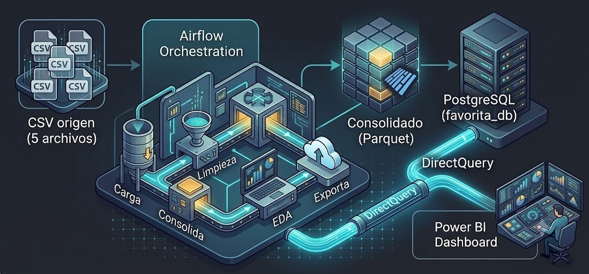

# Pipeline del Dataset de Ventas de Corporación Favorita

## 1. Descripción del proyecto

El proyecto consiste en aplicar todas las etapas del proceso de análisis de datos mediante un pipeline organizado con Apache Airflow, el cual extrae, limpia y analiza los datasets para posteriormente exponer los resultados en PostgreSQL y visualizarlos en tiempo real desde Power BI.

El pipeline se ejecuta en una máquina virtual de Azure, en la cual se utiliza Polars como motor de transformación y PostgreSQL para el almacenamiento de los datos.

---

## 2. Descripción de los archivos del dataset y su rol en el pipeline

| Archivo               | Registros | Columnas | Rol en el pipeline                                                                                                      |
| --------------------- | --------: | -------: | ----------------------------------------------------------------------------------------------------------------------- |
| `train.csv`           | 3,000,888 |        6 | Dataset principal: contiene las ventas diarias por tienda y familia de productos. Es la base del dataset consolidado.   |
| `stores.csv`          |        54 |        5 | Contiene los metadatos de las tiendas, como ciudad, provincia, tipo y clúster. Se une con `train` mediante `store_nbr`. |
| `transactions.csv`    |    83,488 |        3 | Contiene el número de transacciones por tienda y día. Se une mediante `store_nbr` y `date`.                             |
| `oil.csv`             |     1,218 |        2 | Contiene el precio diario del petróleo WTI, utilizado como indicador económico de Ecuador. Se une mediante `date`.      |
| `holidays_events.csv` |       350 |        6 | Contiene los feriados y eventos nacionales, regionales y locales. Se une mediante `date`.                               |

---

## 3. Diagrama de arquitectura de la solución

En esta sección se muestra cómo interactúan los componentes desde la ingesta de los datos hasta su visualización.
<p align="center">
  
</p>


---

## 4. Descripción del DAG: tareas, dependencias y configuración

El DAG se ejecuta manualmente mediante la interfaz de Airflow, utilizando las credenciales que se generan automáticamente al momento de iniciar el servicio.

Al ejecutarlo, comienza todo el proceso de análisis de datos de manera automática, desde la extracción hasta la exportación de los cinco datasets consolidados en uno solo dentro de PostgreSQL, para su correcto consumo desde Power BI.

* **Dependencias:** la carga en la base de datos solo se ejecuta si la validación de la limpieza resulta exitosa.
* **Configuración:** se encuentran configurados tres intentos de reejecución, con cinco minutos de espera entre cada intento.

| Grupo         | Tareas                                                                       | Dependencia                                        |
| ------------- | ---------------------------------------------------------------------------- | -------------------------------------------------- |
| Stores        | `cargar_stores` → `diagnosticar_stores` → `limpiar_stores`                   | Secuencial                                         |
| Train         | `cargar_train` → `diagnosticar_train` → `limpiar_train`                      | Secuencial                                         |
| Transactions  | `cargar_transactions` → `diagnosticar_transactions` → `limpiar_transactions` | Secuencial                                         |
| Holidays      | `cargar_holidays` → `diagnosticar_holidays` → `limpiar_holidays`             | Secuencial                                         |
| Oil           | `cargar_oil` → `diagnosticar_oil` → `limpiar_oil`                            | Secuencial                                         |
| Consolidación | `consolidar`                                                                 | Espera a que finalicen las cinco ramas de limpieza |
| EDA           | `eda_profundo`                                                               | Se ejecuta después de `consolidar`                 |
| Exportación   | `exportacion`                                                                | Se ejecuta después de `eda_profundo`               |

---

## 5. Proceso del pipeline: descripción de cada etapa con capturas de Airflow

**Etapa 1 — Carga:** cada script `cargar_*` lee el CSV origen con Polars y lo escribe como Parquet en `data/processed/`. Cada `diagnosticar_*` perfila el Parquet y agrupa los resultados en `data/reports/reporte_informativo.json`.

**Etapa 2 — Limpieza:** cada script `limpiar_*` cambia el nombre de las columnas a español, corrige tipos como fechas, strings, y escribe un Parquet `_limpio`. Resultados agrupados en `data/reports/reporte_limpio.json`.

**Etapa 3 — Consolidación:** `consolidar_dataset` une `train_limpio` con `stores`, `transactions`, `oil` y `holidays` (todos `left join`, ancla en `train`), y aplica reglas de relleno para las columnas que quedan nulas por registros sin feriado, sin transacción reportada, etc. Resultado: `consolidacion.parquet`, 3,000,888 filas × 17 columnas.

**Etapa 4 — EDA profundo:** `eda_profundo` Se realiza las 14 respuestas analíticas (ventas por familia, ranking de tiendas, estacionalidad, feriados, promociones, petróleo, transacciones) y las exporta a `data/reports/reporte_eda_profundo.json`.

**Etapa 5 — Exportación:** `exportar_consolidado` trunca la tabla `datos_consolidados` en PostgreSQL (sin eliminarla, para no romper las vistas dependientes) e inserta el Parquet consolidado vía ADBC, dentro de una transacción con verificación de el numero de filas antes de confirmar.


---

## 6. Métricas del pipeline

**Registros procesados por etapa (fuente: `reporte_informativo.json` y `reporte_limpio.json`):**

| Dataset | Filas cargadas | Nulos detectados (bruto) | Nulos tras limpieza | Duplicados |
|---|---|---|---|---|
| train | 3,000,888 | 0 | 0 | 0 |
| stores | 54 | 0 | 0 | 0 |
| transactions | 83,488 | 0 | 0 | 0 |
| holidays_events | 350 | 0 | 0 | 0 |
| oil | 1,218 | 43 (en `precio_diario_petroleo`) | 0 (imputados con mediana) | 0 |

**Registros eliminados en limpieza:** 0 filas eliminadas en ningún dataset — no se detectaron duplicados. El único tratamiento fue la imputación de nulos en "oil" y relleno de columnas derivadas del join en la consolidación (feriados/transacciones/petróleo ausentes en fechas sin coincidencia).

---

## 7. Capturas del dashboard de Power BI

En esta sección se presenta la visualización del impacto de las festividades en la línea de tiempo mensual.

<p align="center">
  
</p>


---

## 8. Despliegue: instrucciones para reproducir el entorno

Para desplegar este proyecto en un entorno local o en un servidor, se deben seguir los siguientes pasos:

1. Clonar el repositorio ejecutando el siguiente comando en Bash:

```bash
git clone "https://github.com/SaidxXx09/Analisis_de_Datos_Proyecto/"
```

2. Iniciar la máquina virtual Ubuntu en Azure y verificar que sea posible acceder correctamente a ella.
3. Configurar las credenciales de PostgreSQL.
4. Iniciar Airflow desde Bash.
5. Ingresar a la interfaz de Airflow utilizando las credenciales generadas automáticamente y ejecutar el DAG `favorita_pipeline`.

---

## 9. Conclusiones

---

## 10. Recomendaciones

---
